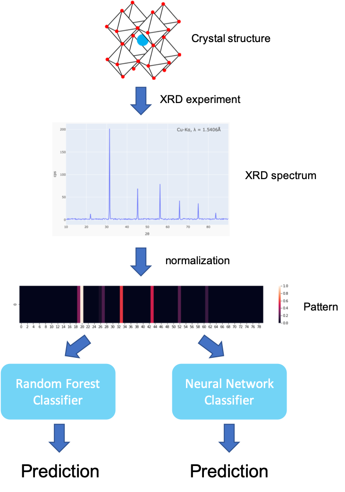
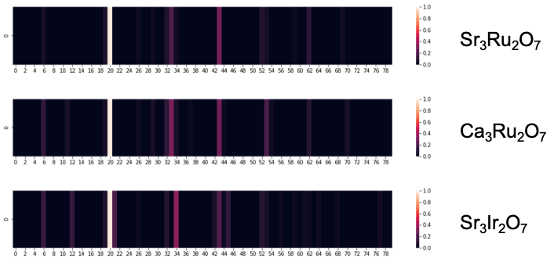

# RP-phase Classifier

This is an app for finding the correponding Ruddlesden-Popper(RP) phase base on X-ray diffraction(XRD) data.

### Background

**RP phases** or **layered perovskites** are a class inorganic materials that share very similar structures. The general fomula of RP-phase can be written as An+1MnO3n+1, where A is usually an alkali earth cation, B is a transition metal cation, O is oxygen anion, and n is the number of layers in the unit cell of crystal structure. This class of materials, due to the stacking perovskite layers, display many different types of physical properties, from insulators to superconductors and from non-magnetic materials to magnets. A brief introduction of RP phases can be found from **[here](https://en.wikipedia.org/wiki/Ruddlesden-Popper_phase)**.

RP-phases are frequently synthesized and heavily studied in my lab. Before digging into their physical properties, one important task that needs to be done is identifying the correct phase i.e. the number of layers **n**. This is usually performed by measuring the XRD from polycrystalline samples. Once the measurement is done, a lengthy and tricky analysis needs to be performed to identify which phase it belongs to, which requires not only a pricy crystal database for reference but also significant amount of knowledge and experience from the researcher. Not to say that the spectrum becomes pretty complicated if the compound is doped. 

The motivation of building this app is to provide a simple tool for quickly identifying the RP-phase based on the measured XRD spectrum. Two models, a random forest classifier and a neural network classifier, are trained and implemented in this app. This new process speeds up the pace of measurements and improves the searching efficiency for new compounds.

### Data normalization

  

The XRD spectrum data is an angular distribution of scattering intensity. More info about XRD can be found from **[here](https://neutrons.ornl.gov/sites/default/files/NX_Miller_2017.pdf)**. The starting point is data normalization is based on the fact the materials from the same phase share similar distribution of spectrum. However, the Bragg peaks(check the link above) scale up and down due to different lattice parameters. Therefore, I renormalize the peak location by setting the highest peak at a specified location (30, for example). The new peak loacation is then mapped into 80 bins, in which intensities are summed together. This process will generate a one-dimensional pattern with 80 rows. As you can see from the picture below, these patterns indeed share similarities within each class.

  

### Model

### How to use

1. Use pip to install all required modules.

`pip install -r requirements`

2. The web browser will automatically open the app by running in Terminal/Command line

`python app.py`

3. Upload the data file. Details of the data including spectrum and highest peaks should show up on the right panel.

4. The predictions from the random forest classifier and the neural network classifier will be displayed on the bottom of right panel.
