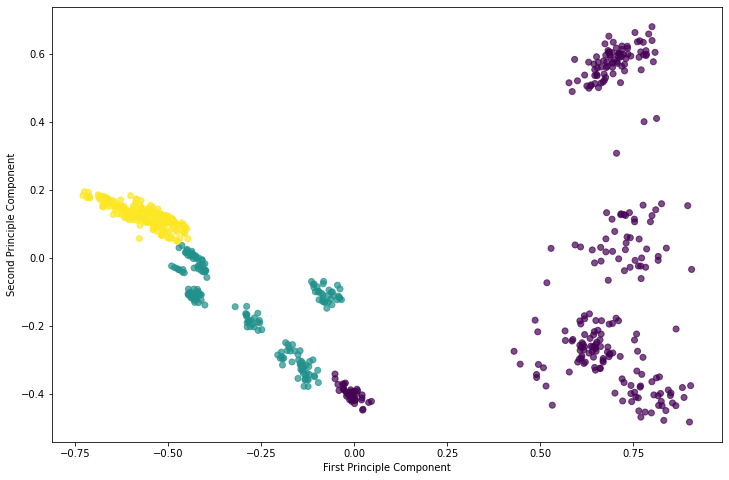
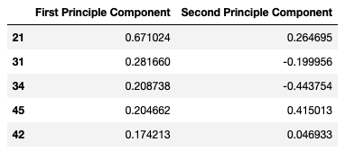
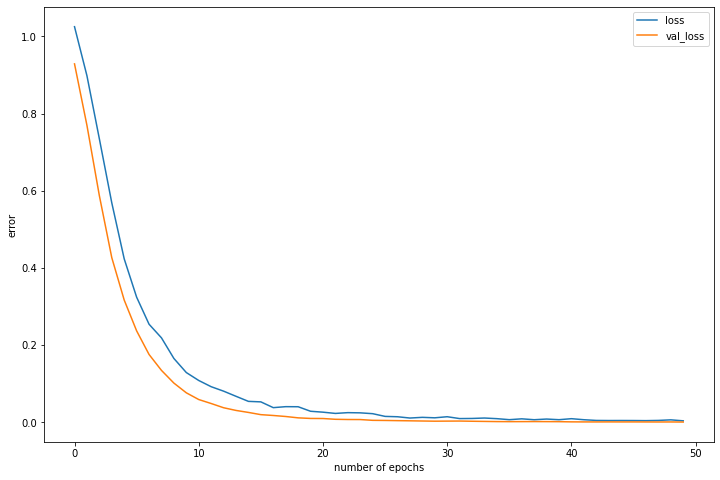

# RP-phase Classifier

This is an app for finding the correponding Ruddlesden-Popper(RP) phase base on X-ray diffraction(XRD) data.

### How to use

1. Use pip to install all required modules.

`pip install -r requirements`

2. The web browser will automatically open the app by running in Terminal/Command line

`python app.py`

3. Upload the data file. Details of the data including spectrum and highest peaks should show up on the right panel.

4. The predictions from the random forest classifier and the neural network classifier will be displayed on the bottom of right panel.

### Background

**RP phases** or **layered perovskites** are a class inorganic materials that share very similar crystal structures. The general fomula of RP-phase can be written as A<sub>n+1</sub>M<sub>n</sub>O<sub>3n+1</sub>, where A is usually an alkali earth cation, B is a transition metal cation, O is oxygen anion, and n is an integer corresponding to the number of layers in the unit cell of crystal structure. This class of materials, due to quasi two-dimensional crystal structure with stacking perovskite layers and correlated d-electrons, display many different types of extoic physical properties, from insulators to superconductors and from non-magnetic materials to magnets. A brief introduction of RP phases can be found from **[here](https://en.wikipedia.org/wiki/Ruddlesden-Popper_phase)**.

RP-phases are frequently synthesized and heavily studied in my lab. Once a new compound is synthesized, one needs to identify the correct phase, i.e. the number of layers **n**, before digging into their physical properties. This is usually performed by measuring the XRD from polycrystalline samples. Once the measurement is done, a lengthy and tricky analysis needs to be performed to identify which phase it belongs to, which requires not only a pricy crystal database for reference but also significant amount of knowledge and experience from the researcher. Not to say that the spectrum becomes pretty complicated if the compound is doped or consists lattice deficiencies. 

The motivation of building this app is to provide a simple tool for quickly identifying the RP-phase based on the measured XRD spectrum. Two models, a random forest classifier and a neural network classifier, are trained and implemented in this app. This new process speeds up the pace of measurements and improves the searching efficiency for new compounds.


### Data normalization

<p align="center">
  
</p>

The XRD spectrum data is an angular distribution of scattering intensity. More info about XRD can be found from **[here](https://neutrons.ornl.gov/sites/default/files/NX_Miller_2017.pdf)**. The initial data normalization is based on the fact the materials from the same phase share similar distribution of spectrum. However, the Bragg peaks(check the link above for explanation) scale up and down due to varing lattice parameters of different materials. Therefore, I renormalize the peak location by setting the highest peak at a specified location (for example, 30, which is a typical range for highest peaks of low miller indices). The new spectrum is then mapped into 80 bins, in which intensities are aggregated together. This process will generate a one-dimensional pattern with 80 features with the maxium value set to 1. It guarantees that all similar spectra generate similar patterns after the treatment. As you can see from the picture below, the patterns from A<sub>3</sub>M<sub>2</sub>O<sub>7</sub> indeed share similarities within each class.

<p align="center">
  
</p>

### Model

#### PCA

A principle component analysis is performed to see what are the most decisive features from the pattern. A  diagram showing classfication as a function of first and second principle components are shown below, where red, green, and purple correspond to A<sub>2</sub>MO<sub>4</sub>, A<sub>3</sub>M<sub>2</sub>O<sub>7</sub> and AMO<sub>3</sub>, respectively.

<p align="center">
  
</p>

The two components separates different catagories pretty well. The main features contributing these two principle components are listed below.

<p align="center">
  
</p>

It seems that No. 21, 31, and 34 are the main features determining the class of material, which corresponds to the main Bragg peaks from 20 to 40 degrees according to my normalization.

#### Random forest classifier

After the pattern is generated, it is sent to two classifiers, a random forest classifier and a neural network classifier. The ranfom forest classifier contains 100 trees in the forest. All trees are set to expand until all their leaves are pure. The number of randomly selected features is set to `sqrt(N)`, where N=80 is the total number of features in the pattern. This method provides more effective features than `log2` since many of the features in the pattern are actually zero due to the nature of spectrum they originate. Larger number of trees are also tested, though the result does not show any significant improvement. 688 spectra, including 287 spectra from A<sub>2</sub>MO<sub>4</sub>, 175 spectra from A<sub>3</sub>M<sub>2</sub>O<sub>7</sub>, and 224 spectra from AMO<sub>3</sub> are used to train and test the model. 30% of the data are used for evaluate the performance of the model, and the obtained confusion matrix is

```
[[94,  0,  0],
 [0,  46,  0],
 [0,  2,  64]]
```

There is little mixing between A<sub>3</sub>M<sub>2</sub>O<sub>7</sub> and AMO<sub>3</sub>, which can be explained by the fact that A<sub>3</sub>M<sub>2</sub>O<sub>7</sub> usually has a much more complicated pattern which may mimic the much simpler AMO<sub>3</sub> pattern. This can be resolved by using more A<sub>3</sub>M<sub>2</sub>O<sub>7</sub> samples to strengthen the classification.

#### Neural network classifier

The initial neural network merely implements 3 dense layers. The number of nodes on these layers are 100, 25, and 3, respectively. Between each dense layer, I added a Dropout layer to prevent the model from overfitting. The error drops below 0.1 after only 15 epochs and show little sign of overfitting. The error as a function of the number of epochs is shown below.

<p align="center">
  
</p>
